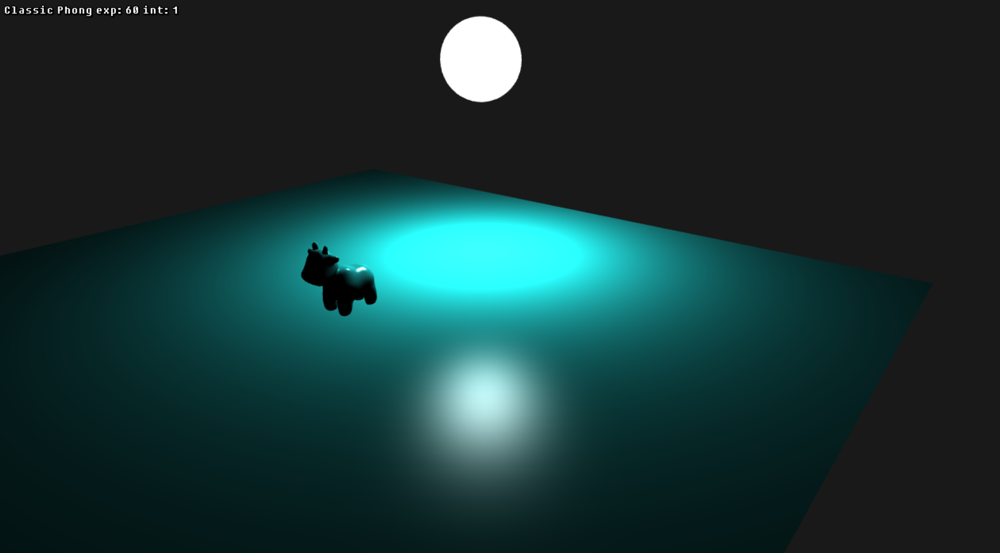
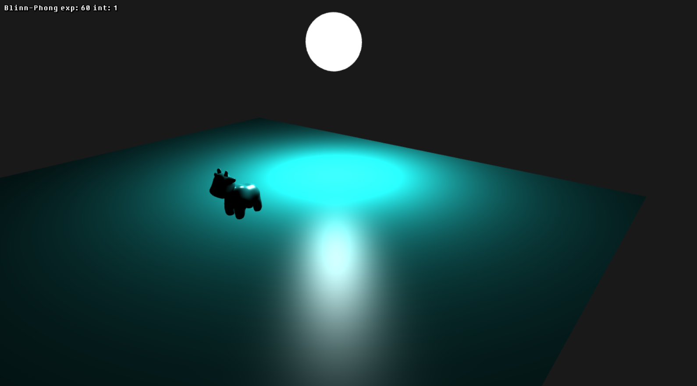
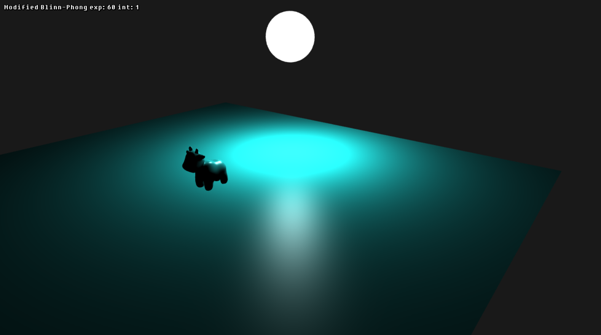
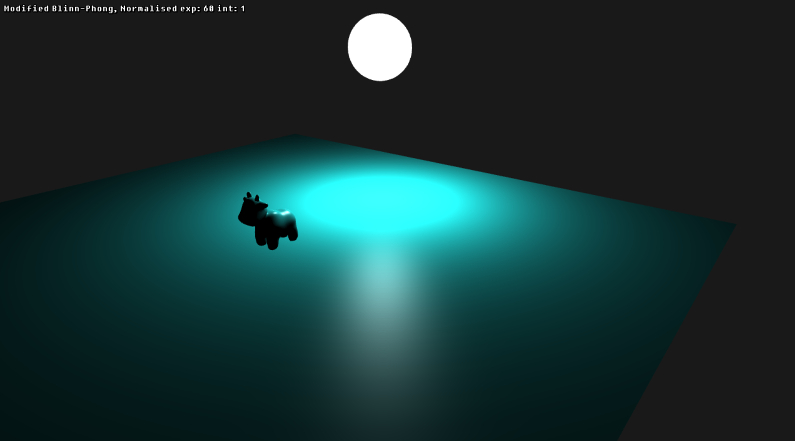
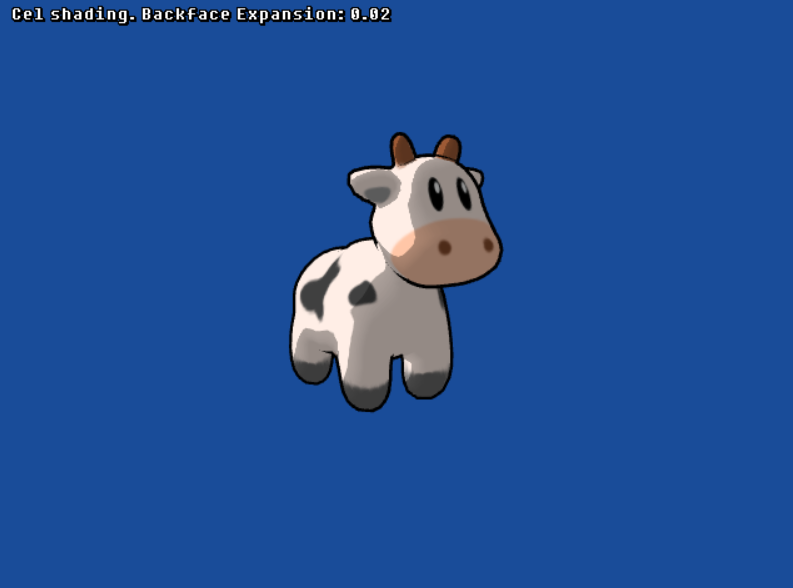
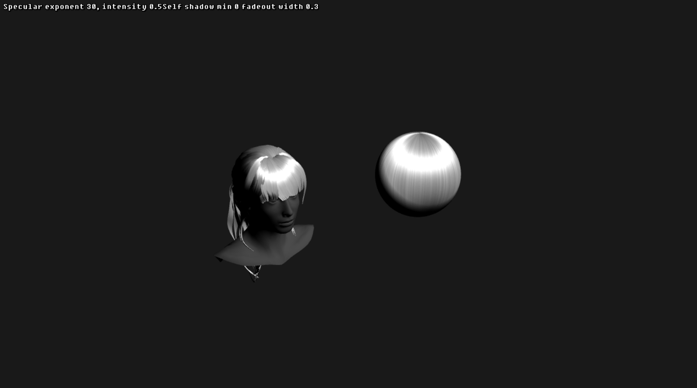

# Week 3 Labs

## 01: Lighting Comparison

In this lab exercise you'll implement and compare the variants of Phong and Blinn-Phong illumination discussed in the lecture. 

### Classic Phong

### Blinn-Phong

### Modified Blinn-Phong

### Modified Blinn-Phong (Normalised)

## 02: Cel Shading

In this exercise you'll implement a non-photorealistic lighting effect: Cel Shading. You'll also learn to use 1D textures as look-up tables. Optionally you can also add backface shell expansion-based outline rendering to get a nice outline around your model.

## 03: Hair Rendering

In the final exercise you'll implement a Kajiya-Kay-based hair shader to more accurately render highlights and diffuse lighting on hair.

